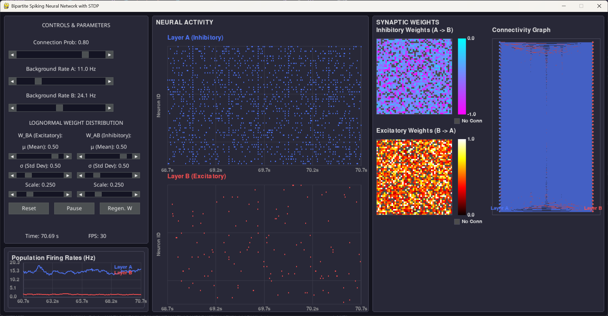

# Basal Ganglia Oscillator

A real-time simulator featuring a bipartite LIF neurons with spike-timing dependent plasticity (STDP), designed to model oscillatory dynamics in basal ganglia circuits.



## Overview

This project implements a computational model of basal ganglia oscillations using a bipartite neural network architecture. The simulation features:

- **Bipartite Network Architecture**: Two interconnected layers with inhibitory (Layer A) and excitatory (Layer B) neurons
- **Leaky Integrate-and-Fire (LIF) Neurons**: Biologically realistic neuron models with membrane dynamics
- **Spike-Timing Dependent Plasticity (STDP)**: Activity-dependent synaptic weight modification
- **Real-time Visualization**: Interactive GUI with raster plots, weight matrices, and population firing rates
- **GPU Acceleration**: Optional CUDA support via CuPy for high-performance computation
- **Interactive Controls**: Real-time parameter adjustment during simulation

## Installation

### Prerequisites

- Python 3.7 or higher
- pip package manager

### Required Dependencies

Install the required packages using pip:

```bash
pip install pygame pygame-gui numpy matplotlib
```

### Optional Dependencies

For GPU acceleration (recommended for larger networks):

```bash
pip install cupy
```

**Note**: CuPy requires CUDA-compatible hardware and CUDA toolkit installation. If CuPy is not available, the simulation will automatically fall back to CPU computation using NumPy.

## Usage

### Basic Usage

Run the main simulation:

```bash
python main.py
```

This will launch the interactive visualization window with default parameters (50 neurons per layer, 30% connectivity).

### GPU/CPU Toggle Demo

To see the runtime switching between CPU and GPU computation:

```bash
python demo_runtime_toggle.py
```

### Interactive Controls

The simulation provides real-time controls for:

- **Connection Probability**: Adjust network sparsity (0.0 - 1.0)
- **Background Rates**: Control external input to each layer (0-50 Hz)
- **STDP Parameters**: Modify learning rates and time constants
- **Weight Parameters**: Adjust synaptic strength distributions
- **Simulation Control**: Pause/resume, reset network, regenerate connections

### Key Features

- **Raster Plots**: Real-time spike visualization for both neuron populations
- **Weight Matrices**: Heatmaps showing synaptic connectivity strength
- **Population Rates**: Time series of firing rates for each layer
- **Network Topology**: Visual representation of connections between layers
- **Performance Monitoring**: FPS and computation mode indicators

## Project Structure

```
BasalGangliaOscillator/
├── main.py                 # Main entry point and simulation launcher
├── network.py              # BipartiteNetwork class with LIF neurons and STDP
├── visualization.py        # NetworkVisualizer class with GUI and plotting
├── demo_runtime_toggle.py  # Demonstration of CPU/GPU switching
├── theme.json              # UI theme configuration
├── snapshot.png            # Example simulation screenshot
└── README.md               # This file
```

### Core Modules

- **`main.py`**: Entry point that initializes and runs the simulation
- **`network.py`**: Contains the `BipartiteNetwork` class implementing:
  - LIF neuron dynamics
  - STDP learning rules
  - CPU/GPU computation switching
  - Vectorized operations for performance
- **`visualization.py`**: Contains the `NetworkVisualizer` class providing:
  - Pygame-based real-time visualization
  - Interactive parameter controls
  - Multiple plot types (raster, heatmaps, time series)
  - Event handling and UI management

## Network Architecture

### Neuron Model

The simulation uses Leaky Integrate-and-Fire (LIF) neurons with:
- Membrane time constant: 20 ms
- Refractory period: 2 ms
- Threshold: -50 mV
- Reset potential: -70 mV
- Resting potential: -65 mV

### Connectivity

- **Layer A → Layer B**: Inhibitory connections (negative weights)
- **Layer B → Layer A**: Excitatory connections (positive weights)
- **Connection Probability**: Adjustable (default: 30%)
- **Weight Distribution**: Log-normal with configurable parameters

### STDP Learning

Spike-timing dependent plasticity modifies synaptic weights based on:
- Pre- and post-synaptic spike timing
- Exponential decay functions
- Separate potentiation and depression time constants
- Configurable learning rates

## Performance

The simulation is optimized for real-time performance:
- **CPU Mode**: Uses NumPy for vectorized operations
- **GPU Mode**: Uses CuPy for CUDA acceleration (when available)
- **Runtime Switching**: Seamless transition between CPU and GPU
- **Typical Performance**: 60 FPS with 100 neurons (50 per layer)

## Requirements

### System Requirements

- **Operating System**: Windows, macOS, or Linux
- **Memory**: 4 GB RAM minimum, 8 GB recommended
- **Graphics**: OpenGL-compatible graphics card
- **CUDA** (optional): For GPU acceleration

### Python Dependencies

| Package | Version | Purpose |
|---------|---------|---------|
| pygame | ≥2.0.0 | Graphics and GUI framework |
| pygame-gui | ≥0.6.0 | UI elements and controls |
| numpy | ≥1.19.0 | Numerical computations |
| matplotlib | ≥3.3.0 | Colormaps and visualization |
| cupy | ≥8.0.0 | GPU acceleration (optional) |

## License

This project is distributed under the MIT License. See the LICENSE file for details.
